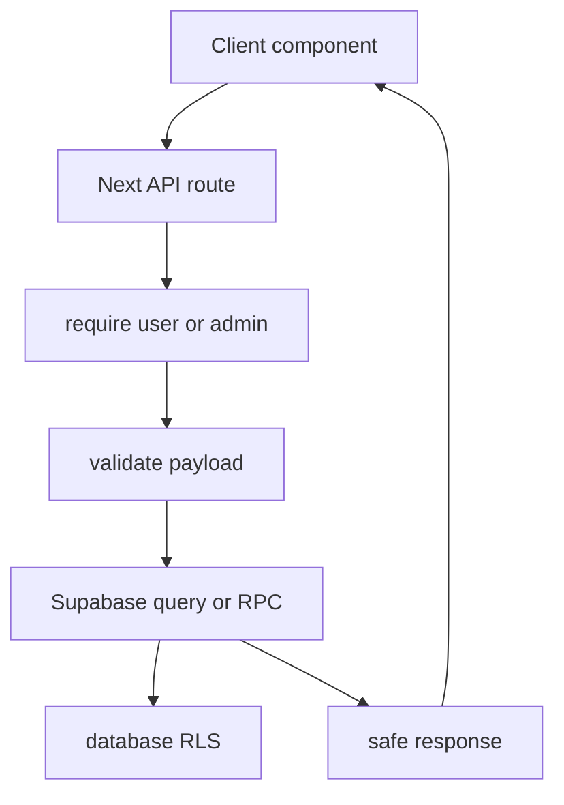

# Backend

The backend is split between Next.js API routes, shared server helpers, Supabase Auth, Supabase Postgres, storage, realtime, and browser push.

## Main Places

- `app/api/`: HTTP endpoints.
- `lib/server-auth.ts`: server-side admin and auth checks.
- `lib/supabase/client.ts`: browser Supabase client setup.
- `lib/server/`: server-only helpers.
- `supabase/migrations/`: database source of truth.

## Backend Flow

## Backend Rules

- Validate input before writing to the database.
- Keep service-role access on the server only.
- Prefer existing library validators.
- Return clear errors without leaking secrets.
- Log admin actions when moderation or account state changes.

## Key References

- [API routes](api-routes.md)
- [Auth and sessions](auth-and-sessions.md)
- [Notifications](notifications.md)
- [Admin backend](admin.md)
