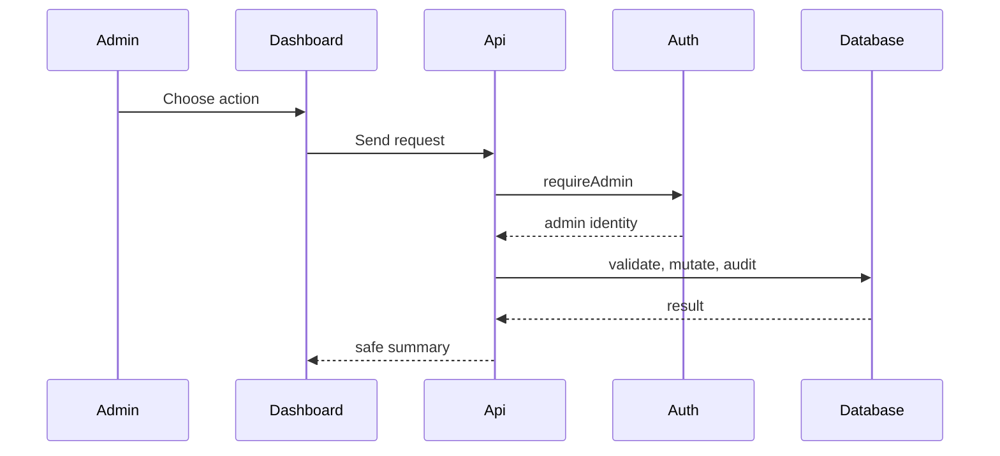

# Admin Backend

Admin features help operate the community safely. They should be powerful, logged, and narrow.

## Admin Areas

- Overview: health and moderation summary.
- Reports: user-submitted content reports.
- People: users, profiles, active state, and account actions.
- Reviewer Trust: reviewer applications and trust state.
- Content: resumes, feedback, and moderation controls.
- Audit: admin action history.
- Data: database and footprint overview.

## Admin Flow

## Important Files

- `components/AdminDashboard.tsx`: admin UI.
- `lib/admin.ts`: admin validation and shared helpers.
- `lib/admin-messages.ts`: admin messaging validation.
- `lib/server-auth.ts`: server admin guard.
- `app/api/admin/**/route.ts`: admin server endpoints.
- `supabase/migrations/*admin*.sql`: database structures and policies for admin actions.

## Admin Safety Rules

- Require admin on every admin API.
- Log account, trust, report, data, and message actions.
- Use pagination for long tables.
- Avoid exposing private data in public UI.
- Prefer report-only cleanup before deletion.
