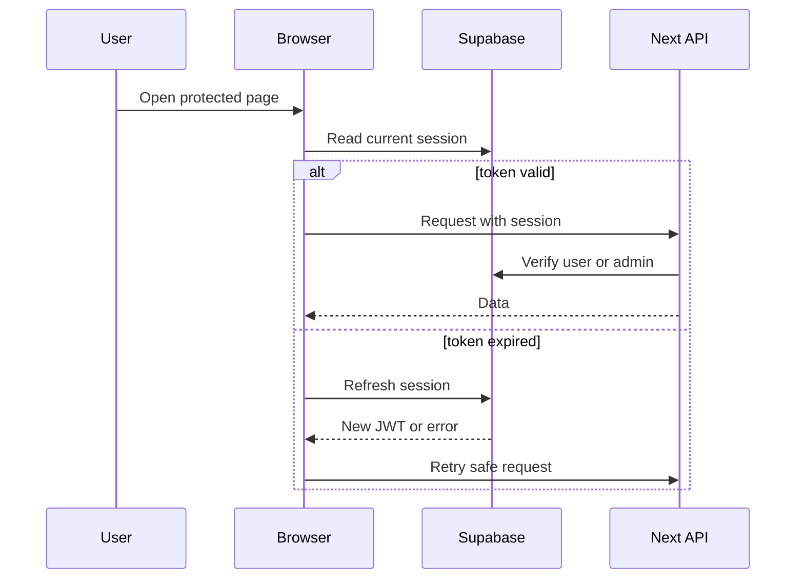

# Auth And Sessions

Auth uses Supabase sessions in the browser and server-side checks in API routes.

## Session Flow

## Important Files

- `components/AuthGate.tsx`: protects browser routes.
- `components/AuthButton.tsx`: sign-in and account button behavior.
- `components/AppPresence.tsx`: session-aware presence heartbeat.
- `lib/auth-session.ts`: client session refresh helper.
- `lib/auth-errors.ts`: JWT and auth error classification.
- `lib/server-auth.ts`: server-side user and admin checks.
- `lib/auth-redirect.ts`: redirect helpers.

## Common Problems

- JWT expired: usually solved by refreshing the Supabase session.
- No project access in Supabase dashboard: usually a dashboard permission issue, not app code.
- Service role leak risk: never expose service role key to browser code.
- Infinite auth loop: check redirect helpers and session refresh retry guards.
