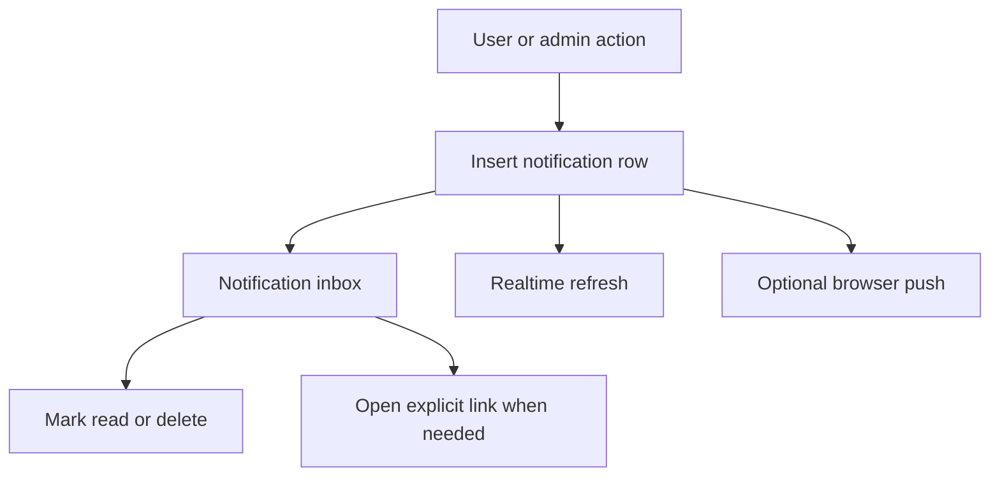

# Notifications

Notifications are the in-app message system for replies, helpful votes, feedback, system messages, and admin messages.

## Notification Flow

## Important Files

- `components/TeamNotifications.tsx`: inbox UI.
- `components/NotificationCenter.tsx`: notification state and filters.
- `lib/notifications.ts`: normalization and notification helpers.
- `lib/admin-messages.ts`: admin message validation.
- `app/api/admin/messages/route.ts`: admin message delivery.
- `app/api/push/subscriptions/route.ts`: push subscription storage.
- `app/api/push/dispatch/route.ts`: push delivery.
- `lib/push-notifications.ts`: push helper logic.
- `lib/server/push.ts`: server push implementation.

## Product Rule

If a message has a long body, users must be able to read it before navigation. Use explicit "Open" actions for links instead of making the whole message body a forced redirect.
