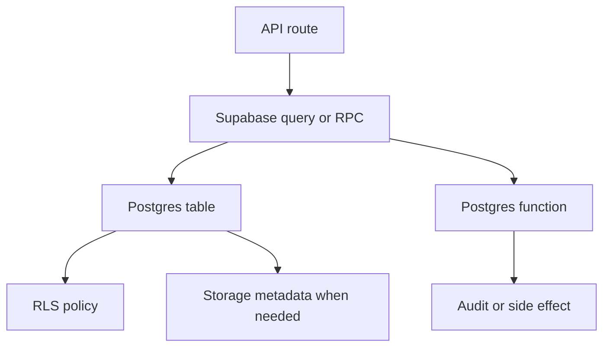

# Database

Supabase Postgres is the source of truth for users, profiles, resumes, reviews, notifications, admin actions, and storage policies.

## Source Of Truth

Ordered migrations in `supabase/migrations/` are the database source of truth. Loose SQL files in `supabase/` are legacy reference files unless a guide explicitly says otherwise.

## Database Flow

## Main Topics

- [Migrations](migrations.md)
- [RLS and security](rls-and-security.md)
- [Data retention](data-retention.md)
- [Database naming map](../database-naming-map.md)

## Rules

- Add new changes as new migrations.
- Do not edit applied migrations casually.
- Use `npm run db:push:dry` before pushing schema changes.
- Keep RLS policies explicit and reviewed.
- Document temp data cleanup before automating deletion.
