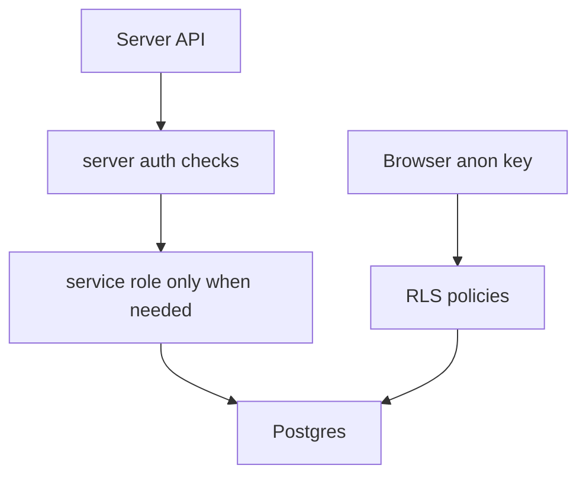

# RLS And Security

RLS means row-level security. It decides which users can read, insert, update, or delete each database row.

## Why It Matters

The browser uses a public anon key. That key is safe only because RLS controls access inside Postgres. If RLS is wrong, users may see or change data they should not touch.

## Security Layers

## Checkpoints

- Browser clients must rely on RLS.
- Server APIs must call auth helpers before sensitive work.
- Service role must never be imported into client components.
- Admin actions must write audit records.
- Storage buckets need policies just like tables.

## Documentation Rule

When a migration changes a policy, function, trigger, or storage rule, update the relevant database doc and regenerate the source atlas.
