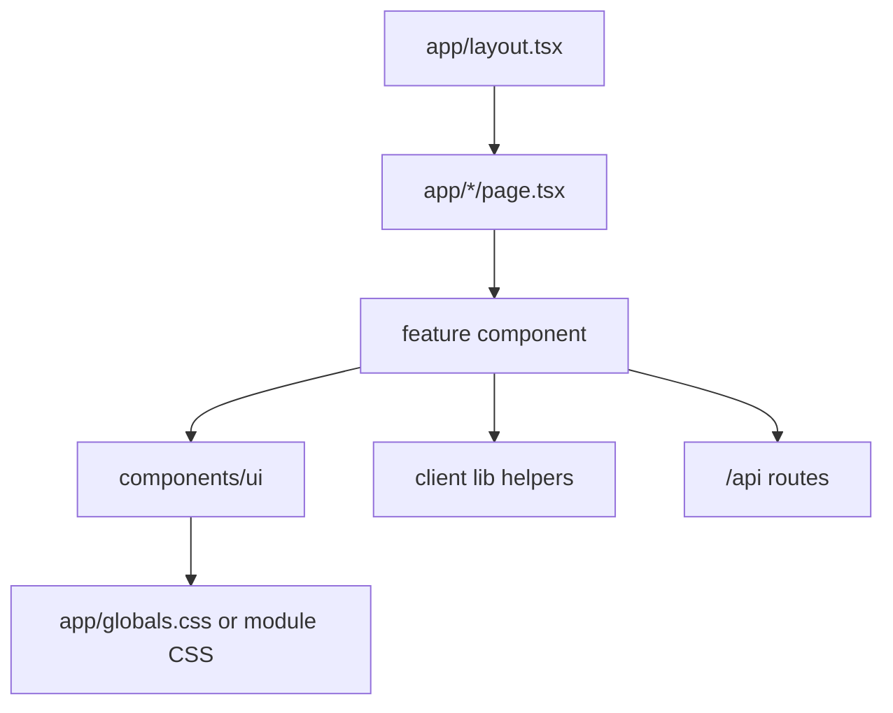

# Frontend

The frontend is the browser side of Linted. It is built with Next.js App Router, React, TypeScript, shared CSS, and component-level UI primitives.

## Main Places

- `app/`: route entry points and global styles.
- `components/`: product components.
- `components/ui/`: reusable primitives.
- `public/assets/`: images, animations, and browser-served files.

## Frontend Flow

## What Belongs In The Frontend

- Page composition.
- Form interactions and client validation hints.
- Responsive layout.
- Accessible dialogs, menus, buttons, tables, and notification panels.
- Calls to API routes or Supabase client helpers.

## What Does Not Belong In The Frontend

- Service-role database access.
- Secrets.
- Final authorization decisions.
- Production database cleanup.
- Long-running admin jobs.

## Key References

- [Routes](routes.md)
- [Components](components.md)
- [UI patterns](ui-patterns.md)
- [Generated source atlas](../generated/source-atlas.md)
