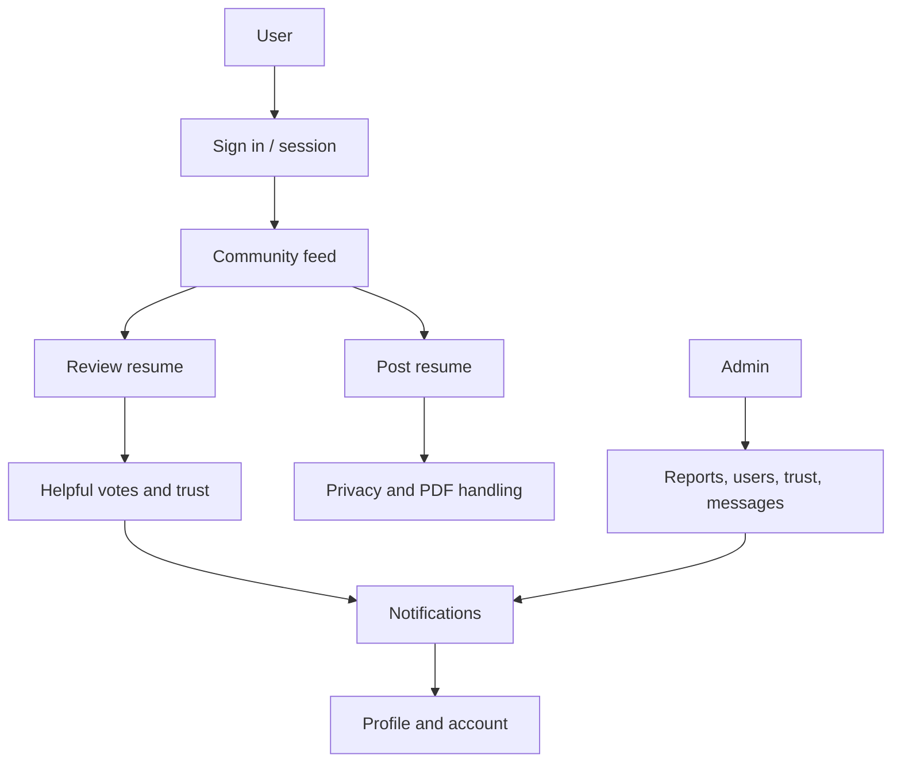

# Start Here

Linted is a resume feedback community. Users post resumes, hide sensitive details, receive comments, vote on helpful feedback, and build trust through useful review activity.

This section explains the app without assuming that you know Next.js, React, TypeScript, or Supabase.

## The Mental Model

Linted has five major layers:

1. Browser pages in `app/`.
2. Reusable React components in `components/`.
3. Shared logic in `lib/`.
4. Server API routes in `app/api/`.
5. Database rules and migrations in `supabase/`.

Most bugs start in one of those layers and pass through another. For example, a notification bug may involve `components/TeamNotifications.tsx`, `lib/notifications.ts`, an API route, and the `notifications` database table.

## Main User Journeys

## Best First Reads

- [Beginner Map](beginner-map.md)
- [Glossary](glossary.md)
- [Where To Fix Things](where-to-fix.md)
- [Frontend overview](../frontend/README.md)
- [Backend overview](../backend/README.md)
- [Database overview](../database/README.md)

## What Not To Touch First

- Do not rewrite migrations that already ran in production. Add a new migration.
- Do not change generated docs by hand. Change source, then run `npm run docs:generate`.
- Do not run `npm audit fix --force` as a casual cleanup. It can change major dependency versions.
- Do not delete files from dead-code reports until the finding is reviewed.
