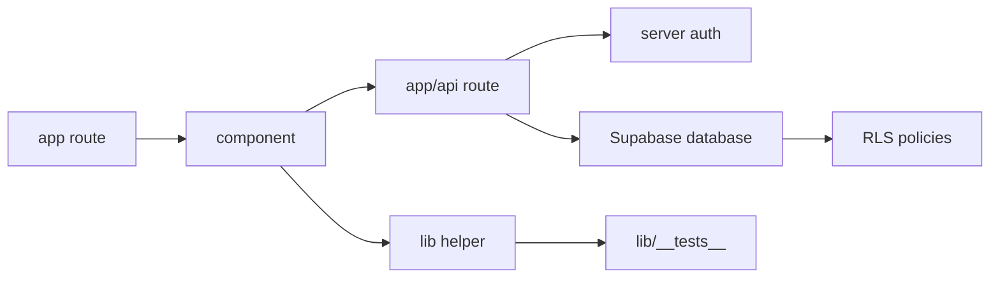

# Beginner Map

This page tells you where things live.

## Root Files

- `package.json`: commands, runtime dependencies, and dev tools.
- `package-lock.json`: exact dependency versions installed by npm.
- `next.config.ts`: Next.js production build settings and Sentry source map upload settings.
- `tsconfig.json`: TypeScript rules and path alias configuration.
- `eslint.config.mjs`: lint rules.
- `.github/workflows/ci.yml`: CI checks that run before merge.

## Application Folders

- `app/`: Next.js App Router pages, layouts, loading states, global CSS, and API routes.
- `components/`: React components used by pages and features.
- `components/ui/`: lower-level UI primitives used by bigger components.
- `lib/`: shared TypeScript logic, validation, auth helpers, ranking, notifications, PDF privacy, and tests.
- `supabase/`: database migrations, local Supabase config, and legacy SQL reference files.
- `public/`: images, animations, browser worker files, and service worker code.
- `docs/`: this documentation system.
- `scripts/`: repository automation such as documentation generation.

## How A Feature Usually Works

## How To Find A File

Use the generated source atlas when you know a topic but not the exact file:

- [Generated Source Atlas](../generated/source-atlas.md)
- `docs/generated/source/*.md` for per-file details.

Each generated file page tells you what the file does, when to edit it, imports, exports, named functions, detected types, related tests, and SQL objects where relevant.
